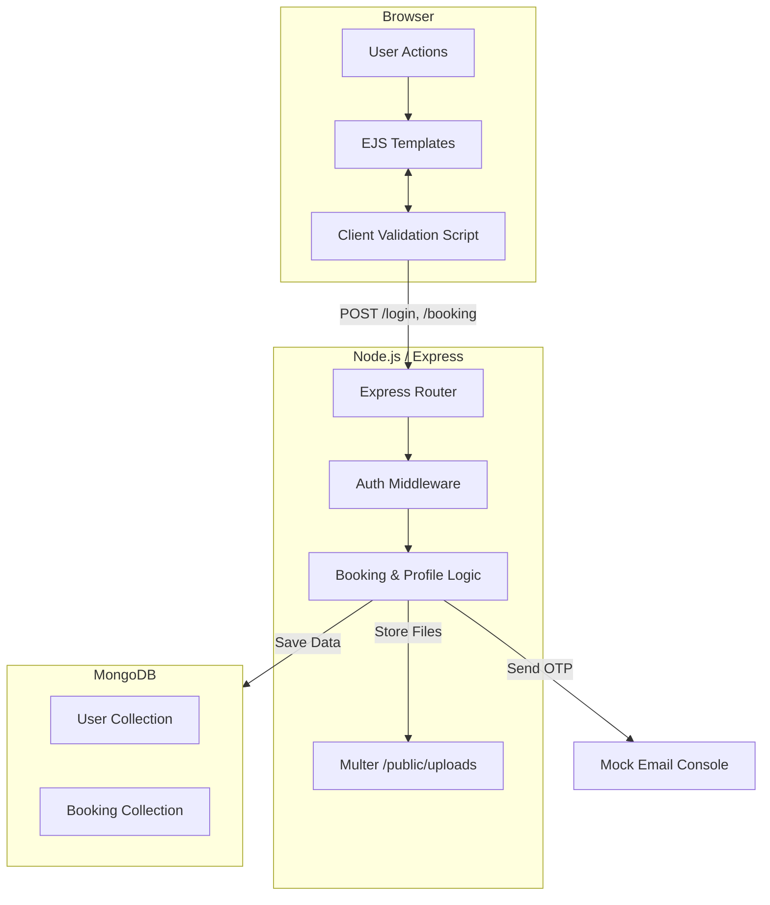

# Tourizio - Tourism Booking Platform

Tourizio is a robust, full-stack travel booking application designed to provide a seamless experience for users to browse destinations, book tours, and manage their travel profiles. It features a secure authentication system, real-time booking validation, and a dynamic user dashboard.

## 🚀 Features

### 🌍 Destination & Booking Management
- **Interactive Booking Flow**: Dynamic guest form generation based on guest count.
- **Cost Calculation**: Real-time price updates based on destination, nights, and guest count.
- **Strict Validation**: Server-side and Client-side checks to prevent invalid dates, ages, or guest details.
- **Smart Cancellation**: 24-hour cancellation window logic with visual countdown timers.

### 🔐 Advanced Security & Auth
- **Session-Based Authentication**: Secure login/signup system using `express-session`.
- **3-Step Email Update**: Secure OTP-based verification flow for critical profile changes.
- **Input Sanitization**: comprehensive blocking of invalid characters (e.g., blocking numbers in names, blocking scientific notation in numeric fields).

### 👤 User Profile
- **Avatar Management**: Profile picture upload with strict file type validation (Images only).
- **Personal Dashboard**: View booking history, status (Confirmed/Cancelled), and manage personal details.

## 🛠️ Technical Stack

- **Frontend**: 
  - **EJS (Embedded JavaScript)**: Server-side templating for dynamic views.
  - **CSS3 / Bootstrap 5**: Custom responsive design system.
  - **Vanilla JS**: DOM manipulation, dynamic form handling, and input strictness logic.
- **Backend**:
  - **Node.js & Express.js**: RESTful server architecture.
  - **MongoDB & Mongoose**: Data modeling for Users and Bookings.
  - **Middleware**: Custom authentication guards (`isAuthenticated`).
- **Utilities**:
  - **Multer**: Secure file uploads.
  - **Nodemailer**: Mock email service for OTPs (logs to console).

## 🏗️ Project Architecture

Tourizio follows a classic MVC (Model-View-Controller) pattern adapted for a Node.js environment.



## 📂 Project Structure

```
Tourizio/
├── models/             # Mongoose Schemas (User.js, Booking.js)
├── public/
│   ├── css/            # Custom Styles
│   ├── js/             # Client-side Validation Scripts
│   └── uploads/        # User Avatars
├── views/              # EJS Templates (pages & partials)
├── server.js           # Main Application Entry Point
└── package.json        # Dependencies & Scripts
```

## ⚙️ Getting Started

### Prerequisites
- Node.js (v16+)
- MongoDB (Running locally or generic URI)

### Installation

1. **Clone the repository**
   ```bash
   git clone https://github.com/karansingh008/Tourizio.git
   cd Tourizio
   ```

2. **Install Dependencies**
   ```bash
   npm install
   ```

3. **Start the Server**
   ```bash
   npm start
   ```
   The app will run at `http://localhost:3000`.

4. **VerifyDB Connection**
   Ensure your local MongoDB is running (`mongodb://127.0.0.1:27017/tourizio`).

## 🛡️ License
This project is open-source and available for educational purposes.
